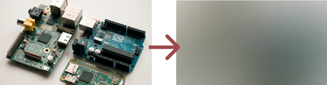

# A small CLI tool to generate placeholder images

This is a tiny command line application that generates a base64 encoded preview of an image to be used with progressive image loading. I built this mainly for myself but decided to open source it in case other people might find it useful.

I use this to generate placeholders for static images that don't get handled by the backend (otherwise I would just generate the placeholder there).



## Installation

Either download the latest [release binary](https://github.com/ksassnowski/create-image-placeholder/releases) (currently only build for Mac because I'm bad at Github Actions), or install via brew

```
brew install generate-image-placeholder
```

## Usage

```bash
$ preview ./my-image.jpg

/9j/2wCEAAEBAQEBAQEBAQEBAQEBAQEBAQEBAQEBAQEBAQEBAQEBAQEBAQEBAQEBAQEBAQEBAQEBAQEBAQEBAQEBAQEBAQEBAQEBAQEBAQEBAQEBAQEBAQEBAQEBAQEBAQEBAQEBAQEBAQEBAQEBAQEBAQEBAQEBAQEBAQEBAQEBAQEBAQEBAf/ [snip]
```

Or pipe it directly to your clipboard (OSX):

```bash
$ preview ./my-image.jpg | pbcopy
```

Now you can use it as a placeholder while your real image loads.

```html

```

How to actually _implement_ progressive image loading is out of scope for this readme. There are multiple ways to go about it, however. See the links below for inspiration.

## Further Reading

- [Taking A Look At The State Of Progressive Images And User Perception](https://www.smashingmagazine.com/2018/02/progressive-image-loading-user-perceived-performance/) (2018)
- [How Medium does progressive image loading](https://jmperezperez.com/medium-image-progressive-loading-placeholder/) (2015)